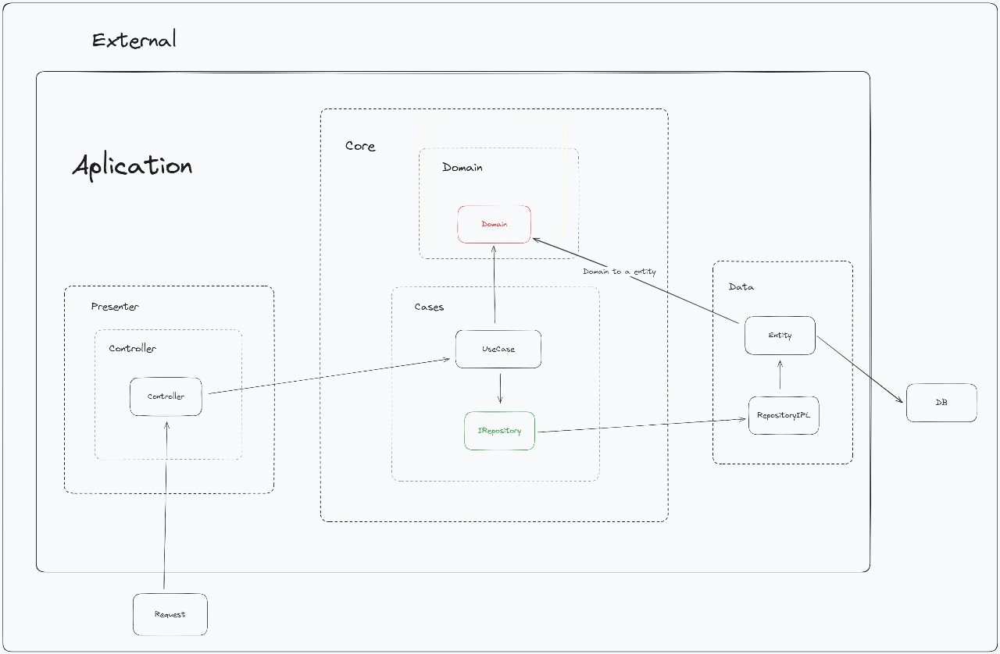

# Sistema de Gerenciamento de Hotel

Projeto criado para a disciplina de Padrões de Projeto. Visando criar um sistema de gerenciamento para um hotel fictício.

Membros 
- Pedro Henrique Alexandre
- Ramon de Oliveira Bento 
- Igor Vinicius da Silva
- Maria Cecília dos Santos

## Diagrama da Arquitetura de Padrão do Projeto

O projeto foi estruturado de tal maneira que cada pasta contenha apenas as classes com suas designadas responsabilidades.

Diagrama de Padrão MVVM (Model-View-ModelView) mostrando os relacionamentos entre as classes

As principais pastas são:

### BD

**BD** - A pasta que futuramente será responsável pelo banco de dados do projeto, onde os dados são salvos entre as diferentes execuções.

### Repository

**Repository** - Classes responsáveis por conectarem o código com o Banco de Dados.

Cada classe instancia uma lista de objetos de uma determinado classe do Model (Por exemplo, RoomRepository instância uma lista de Rooms).

Essa lista então serve como uma ponte entre os UseCases e o Banco de Dados.

Inves dos métodos das classes UseCase salvarem diretamente suas modificações no Banco de Dados, elas salvam as alterações na lista de objetos da sua classe Repositório.

E então a classe Repositório é responsável por salvar as modificações feitas na lista no Banco de Dados.

### Wrapper

**Wrapper** - Classes responsáveis por englobar tipos primitivos e realizarem sua validação de dados. Por exemplo, a classe CPF que engloba o tipo Integer e se assegura que apenas CPF válidos são instanciados.

### Model

**Model** - Classes responsáveis por instanciar entidades do hotel (Convidados, Quartos, Reservas, [...])

### UseCases

**UseCases** - Classes responsáveis por alterarem e interagirem com as classes do Model, criando seus métodos. Por exemplo o método para editar um Convidado ou o método para fazer o check-out numa reserva. 

Elas servem como uma ponte que conecta o Controller ao Model. Impedindo que modificações erradas sejam feitas diretamente nas classes do Model.

E também fazem chamadas e atualizações no repositório de sua classe model específica, através da interface do repositório.

### Controller

**Controller** - Classes responsáveis por chamarem o UseCases. Servindo como uma ponte entre o Main e os UseCases.

### Main

**Main** - A classe de execução. Contendo a interface textual do projeto.

**Screens** - Classes que serão responsáveis por conterem as telas da interface gráfica, que serão futuramente feitas com o Netbeans.

## Diagrama de Classes do Banco de Dados

